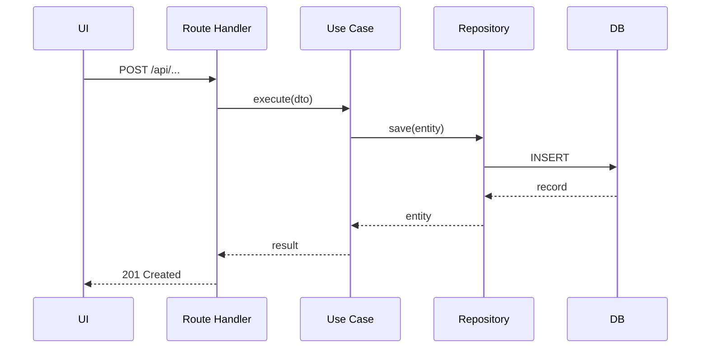

# Arquitetura — [Nome do Fluxo]

## Visão Geral
[Descrição do fluxo ou componente arquitetural]

## Camadas Envolvidas

| Camada | Arquivo | Responsabilidade |
|--------|---------|-----------------|
| UI | `components/*/` | |
| Route Handler | `app/api/*/route.ts` | |
| Use Case | `server/modules/*/application/` | |
| Repository | `server/modules/*/infra/` | |

## Diagrama de Sequência

## Trade-offs
- **Vantagem**:
- **Desvantagem**:

## Performance
[Notas sobre N+1, índices, cache necessário]
