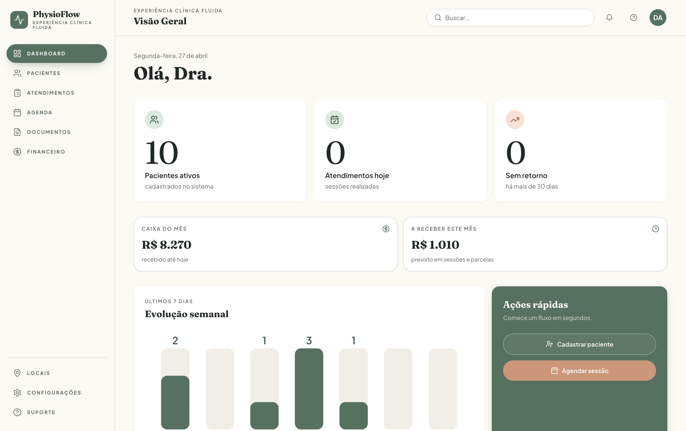
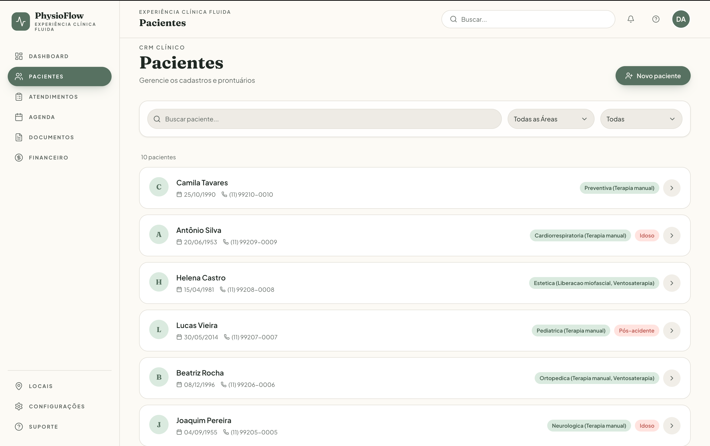
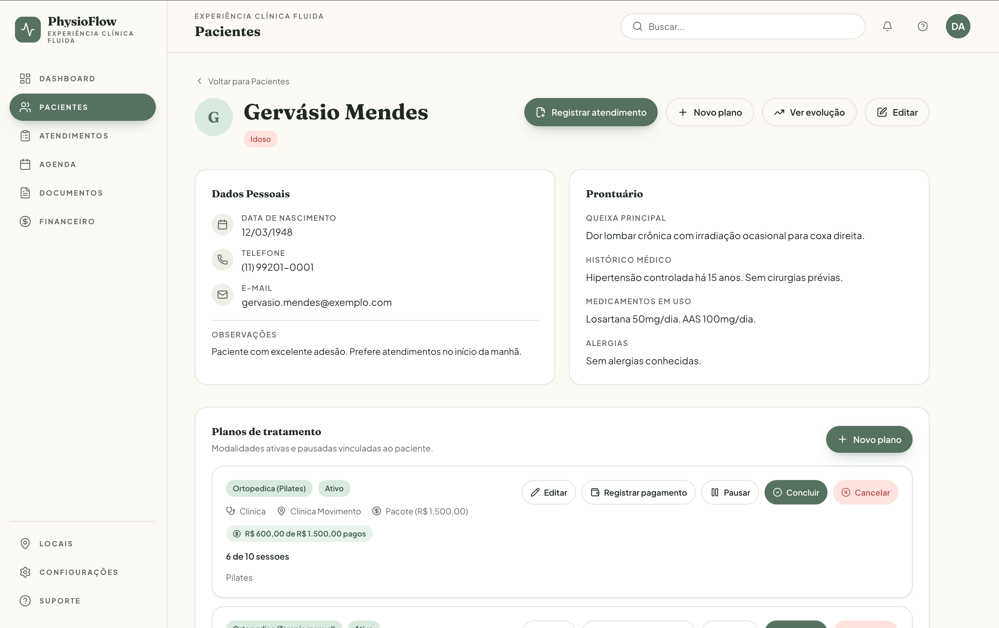
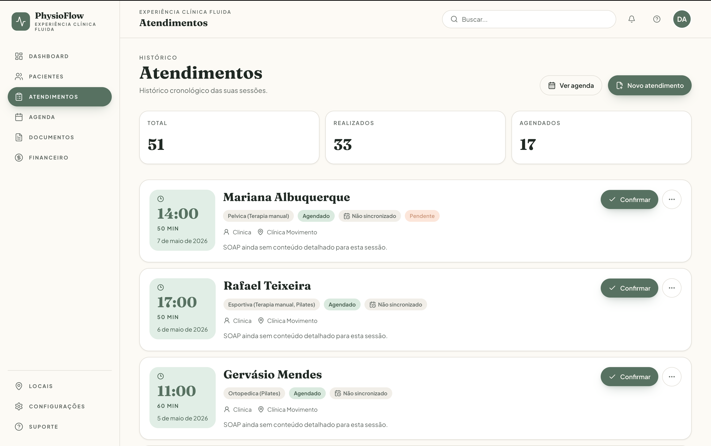
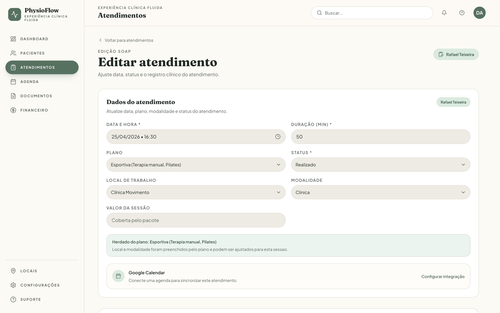
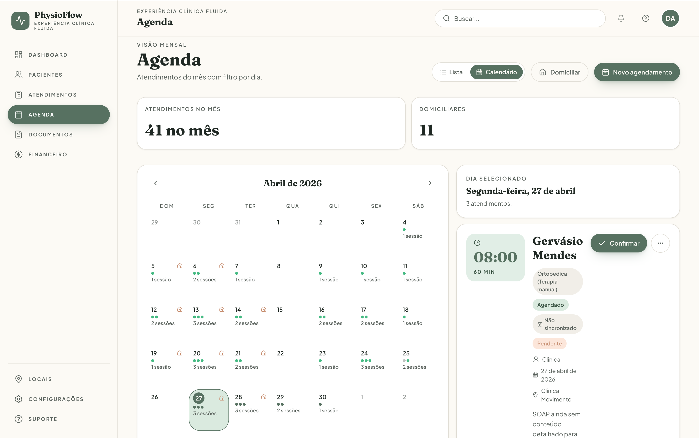
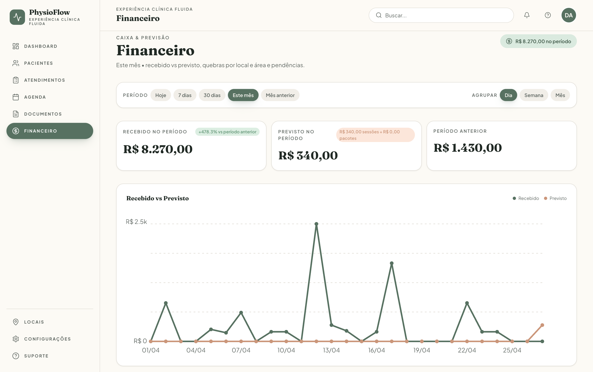
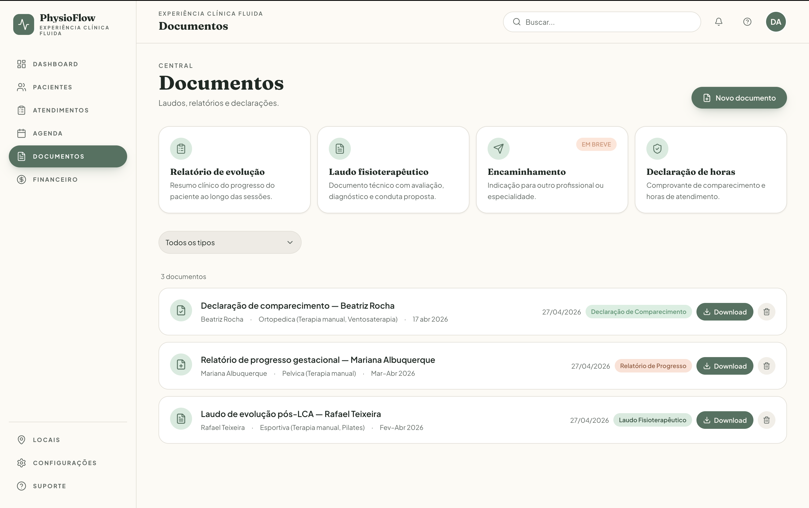

# 🌿 PhysioFlow

> **Gestão clínica fluida, resultados restaurativos.**

SaaS fullstack para fisioterapeutas que centraliza toda a operação clínica em um único lugar — do cadastro do paciente ao laudo final, passando por evolução SOAP, agenda, documentos e cobrança.

`Next.js 16` `TypeScript` `Prisma` `PostgreSQL (Neon)` `Tailwind CSS v4` `Zod` `Vercel`

---

## Overview

PhysioFlow resolve a dispersão da operação clínica do fisioterapeuta. Hoje, prontuários ficam em papel, laudos são feitos manualmente em editores de texto, agenda mora no Google Calendar, cobrança em planilha. O resultado é menos tempo com o paciente e mais com burocracia.

O sistema entrega:

- **CRM clínico** com classificação, logística domiciliar e prontuário base
- **Registro SOAP** padronizado e timeline cronológica de evolução
- **Agenda** em lista e calendário mensal, com filtro domiciliar e priorização
- **Documentos** (laudos, relatórios, declarações) gerados em PDF on-demand
- **Multi-modalidade** clínica via planos de tratamento por área e especialidade
- **Financeiro** com pagamentos avulsos e em pacote, snapshot de valor por sessão e dashboard de recebido vs previsto
- **Integrações** nativas com Gmail (App Password) e Google Calendar (OAuth) com tokens criptografados em AES-256-GCM

---

## How it works

```
1. Cadastrar paciente   →  CRM com prontuário base e logística domiciliar
2. Definir plano        →  Modalidade, área, especialidade, local e cobrança (avulso ou pacote)
3. Agendar sessão       →  Lista ou calendário; sync opcional com Google Calendar
4. Atender              →  Registro SOAP, status REALIZADO/CANCELADO
5. Gerar documentos     →  Laudo, relatório ou declaração em PDF; envio por e-mail opcional
6. Receber              →  Registro de pagamento (PIX, cartão, dinheiro, convênio…)
7. Acompanhar           →  Dashboard de KPIs clínicos + Dashboard financeiro
```

---

## Screenshots

> Imagens armazenadas em [`.docs/screenshots/`](.docs/screenshots).

| Tela                                                              | Descrição                                                                          |
| ----------------------------------------------------------------- | ---------------------------------------------------------------------------------- |
|                   | KPIs clínicos, mini-cards financeiros (caixa do mês, a receber) e gráfico semanal  |
|    | Lista de pacientes com filtros por classificação e área terapêutica                |
|      | Dados pessoais, prontuário, planos de tratamento e seção financeira                |
|       | Histórico cronológico de sessões com badges de status e pagamento                  |
|            | Formulário SOAP com plano, local, modalidade e campo `expectedFee`                 |
|              | Calendário mensal com indicadores de status, contagem por dia e painel lateral    |
|                 | Recebido vs previsto, série temporal, breakdowns por local/área e pendências      |
|                 | Geração de PDF (laudo, relatório, declaração) com envio por e-mail opcional        |

---

## Funcionalidades

- **CRM de Pacientes** — Cadastro com classificação (Idoso, PCD, Pós-acidente) e arquivamento lógico
- **Registro SOAP** — Subjetivo, Objetivo, Avaliação e Plano por sessão
- **Timeline de Evolução** — Histórico cronológico do progresso do paciente
- **Dashboard de KPIs** — Pacientes ativos, atendimentos da semana, alertas de inatividade e ações rápidas
- **Central de Documentos** — Geração on-demand via `@react-pdf/renderer` (laudos, relatórios, declarações)
- **Logística Domiciliar** — Endereço, prioridade (`URGENT` / `HIGH` / `NORMAL`) e agenda filtrada por tipo
- **Locais de Trabalho** — Cadastro de clínicas próprias, parceiras, particular e online com defaults próprios
- **Planos de Tratamento** — Multi-modalidade por paciente; cobrança avulsa (`PER_SESSION`) ou em pacote (`PACKAGE`)
- **Pagamentos** — Snapshot `expectedFee` por sessão, cache `paymentStatus`, soft delete via `REFUNDED`
- **Dashboard Financeiro** — Recebido vs previsto, série temporal, quebras por local e área, tabela de pendências com ação "marcar pago"
- **E-mail (Gmail App Password)** — Envio de laudo e aviso de sessão; senha criptografada em AES-256-GCM
- **Google Calendar (OAuth)** — Sync unidirecional PhysioFlow → Google com agenda padrão e tokens criptografados

---

## Architecture

### Camadas (clean-ish architecture)

```
UI (React Server Components)
        │
        ▼
Route Handlers (app/api/**/route.ts)   ← adaptadores HTTP finos
        │
        ▼
Use Cases (server/modules/**/application/)   ← regra de negócio
        │
        ▼
Domain (server/modules/**/domain/)           ← entidades e errors
        │
        ▼
Repositories (server/modules/**/infra/)      ← Prisma
        │
        ▼
PostgreSQL (Neon, serverless)
```

### Princípios

- **Multi-tenant** — toda query filtra por `userId`; isolamento total por usuário
- **Validação na borda** — Zod em todos os DTOs HTTP e formulários
- **Route Handlers finos** — sem lógica de negócio
- **Soft delete** — `isActive: boolean` em pacientes/sessões/documentos; `REFUNDED` em `Payment`
- **Decimal as string** entre Server e Client Components (precisão financeira)
- **Tokens externos criptografados** (Gmail App Password, OAuth Google) com AES-256-GCM

---

## Tech Stack

| Camada       | Tecnologia            | Por quê                                           |
| ------------ | --------------------- | ------------------------------------------------- |
| Framework    | Next.js 16 App Router | Full-stack com RSC, sem backend separado          |
| Linguagem    | TypeScript            | Segurança de tipos end-to-end                     |
| Estilo       | Tailwind CSS v4       | Tokens OKLCH nativos, design system sólido        |
| Componentes  | shadcn/ui (Radix)     | Acessíveis, headless, totalmente personalizáveis  |
| ORM          | Prisma 7              | Type-safe, migrations versionadas, adapter PG     |
| Banco        | PostgreSQL (Neon)     | Serverless, branching de banco, free tier robusto |
| Validação    | Zod                   | Schemas com inferência de tipos                   |
| Auth         | iron-session          | Cookie HTTP-only criptografado                    |
| Senhas       | bcryptjs              | Hash com salt automático                          |
| PDF          | @react-pdf/renderer   | Geração on-demand server-side                     |
| E-mail       | nodemailer            | SMTP com Gmail App Password                       |
| Calendário   | googleapis            | Cliente OAuth oficial do Google Calendar          |
| Testes       | Vitest                | Test runner moderno e rápido                      |
| Lint/Format  | ESLint + Prettier     | Padronização automática                           |
| Deploy       | Vercel                | Build zero-config, edge functions                 |

---

## Project Structure

```
.
├── prisma/
│   ├── migrations/                # Migrations versionadas (phase14_…, phase15a_…, phase16_…)
│   ├── schema.prisma              # Schema único (User, Patient, Session, Payment, …)
│   └── seed.ts                    # Seed demo
├── src/
│   ├── app/
│   │   ├── (auth)/                # Login, Register
│   │   ├── (app)/                 # Áreas autenticadas (Dashboard, Pacientes, …)
│   │   │   ├── dashboard/
│   │   │   ├── pacientes/[id]/
│   │   │   ├── atendimentos/
│   │   │   ├── agenda/
│   │   │   ├── financeiro/
│   │   │   ├── documentos/
│   │   │   └── configuracoes/     # E-mail, integrações, locais
│   │   ├── api/                   # Route Handlers REST
│   │   └── proxy.ts               # Auth gate (middleware do Next 16)
│   ├── components/
│   │   ├── ui/                    # Base (shadcn/ui + customizações temáticas)
│   │   ├── patients/, sessions/, treatment-plans/, payments/, finance/, …
│   │   └── layout/                # Sidebar, Topbar, AppShell
│   ├── server/
│   │   └── modules/
│   │       ├── auth/, patients/, sessions/, treatment-plans/,
│   │       ├── workplaces/, payments/, finance/,
│   │       └── email/, calendar/, documents/, dashboard/
│   │           ├── application/   # Use Cases (+ testes)
│   │           ├── domain/        # Entidades e erros
│   │           ├── http/          # DTOs Zod
│   │           └── infra/         # Repository Prisma
│   ├── lib/                       # prisma client, session, crypto, date, pdf, …
│   └── generated/prisma/          # Cliente Prisma gerado
└── .docs/
    ├── CONTEXT.md                 # Estado vivo do projeto
    ├── CHANGELOG.md
    ├── architecture/, decisions/, domain/, api/, data/, tasks/
    └── screenshots/               # Imagens deste README
```

---

## Modelo de Dados

```
User           → Patient        (1:N)
User           → Workplace      (1:N)
Patient        → ClinicalRecord (1:1)
Patient        → TreatmentPlan  (1:N)        ← multi-modalidade
Patient        → Document       (1:N)
TreatmentPlan  → Session        (1:N)
TreatmentPlan  → Payment        (1:N)        ← pacote
Session        → Payment        (0:1)        ← avulso
Session        → expectedFee + paymentStatus  ← snapshot/cache
Workplace      → Session        (1:N)
User           → CalendarConnection / EmailSettings  ← integrações criptografadas
```

XOR entre `Payment.treatmentPlanId` e `Payment.sessionId` validado por `CHECK CONSTRAINT` em SQL.

---

## API (principais endpoints)

Todos os endpoints exigem autenticação via cookie `phisioflow_session` e filtram por `userId`.

```
# Pacientes
GET    /api/patients                          # listar (filtros: ?q, ?classification, ?area)
POST   /api/patients                          # criar (DTO Zod)
GET    /api/patients/:id
PUT    /api/patients/:id
DELETE /api/patients/:id                      # soft delete (isActive=false)

# Planos de tratamento
GET    /api/patients/:id/treatment-plans
POST   /api/patients/:id/treatment-plans
PUT    /api/treatment-plans/:id
POST   /api/treatment-plans/:id/pause | resume | complete
DELETE /api/treatment-plans/:id               # cancela

# Sessões (SOAP)
GET    /api/sessions                          # filtros: ?from, ?to, ?status, ?attendanceType, ?area
POST   /api/sessions
PUT    /api/sessions/:id
POST   /api/sessions/:id/email-reminder       # aviso por e-mail
POST   /api/sessions/:id/calendar-sync        # cria/atualiza no Google
DELETE /api/sessions/:id/calendar-sync        # remove do Google

# Pagamentos
POST   /api/treatment-plans/:id/payments      # pacote
POST   /api/sessions/:id/payments             # avulso
GET    /api/payments?from&to&patientId&planId&status
PUT    /api/payments/:id
DELETE /api/payments/:id                      # soft delete (REFUNDED)
GET    /api/treatment-plans/:id/financials    # saldo do plano
GET    /api/patients/:id/financials           # saldo agregado do paciente

# Financeiro
GET    /api/finance/summary?from&to&granularity&workplaceIds&areas

# Documentos
POST   /api/documents                         # gera e retorna metadados
GET    /api/documents/:id/download            # PDF on-demand
POST   /api/documents/:id/email               # envio via Gmail SMTP

# Integrações
GET    /api/integrations/google-calendar      # status conexão
GET    /api/integrations/google-calendar/connect | callback
GET    /api/integrations/google-calendar/calendars
PUT    /api/integrations/google-calendar      # define agenda padrão
GET    /api/settings/email
PUT    /api/settings/email
POST   /api/settings/email/test
```

Detalhes em [`.docs/api/`](.docs/api/).

---

## Setup

### Pré-requisitos

- Node 20+ (recomendado 22)
- Conta Neon (PostgreSQL serverless) com `DATABASE_URL`
- (Opcional) Conta Google Cloud com OAuth Client ID para Google Calendar
- (Opcional) Conta Gmail com Senha de App para envio de e-mails

### Instalação

```bash
# 1. Clonar e instalar dependências
git clone https://github.com/Senavictors/PhisioFlow.git
cd PhisioFlow
npm install

# 2. Variáveis de ambiente
cp .env.example .env
# Preencher: DATABASE_URL, SESSION_SECRET, INTEGRATION_ENCRYPTION_KEY,
# GOOGLE_CLIENT_ID, GOOGLE_CLIENT_SECRET, GOOGLE_CALENDAR_REDIRECT_URI

# 3. Aplicar migrations no banco remoto (Neon)
npx prisma migrate deploy

# 4. (Opcional) Seed demo
npx prisma db seed
```

### Comandos

```bash
npm run dev          # Dev server em http://localhost:3000
npm run build        # Build de produção
npm run lint         # ESLint
npm run format       # Prettier (write)
npm test             # Vitest (41 testes)
npx prisma studio    # GUI do banco
```

### Usuário demo (após seed)

- E-mail: `demo@phisioflow.com`
- Senha: `demo1234`

---

## Documentação

| Camada      | Arquivo                         | Propósito                          |
| ----------- | ------------------------------- | ---------------------------------- |
| Visão       | `.docs/vision.md`               | Problema, personas, métricas       |
| Contexto    | `.docs/CONTEXT.md`              | Estado vivo do projeto             |
| Arquitetura | `.docs/architecture/README.md`  | Camadas e princípios               |
| Domínio     | `.docs/domain/*.md`             | Regras de negócio clínicas         |
| API         | `.docs/api/*.md`                | Contratos de endpoints             |
| Dados       | `.docs/data/data-dictionary.md` | Schema e enums                     |
| Decisões    | `.docs/decisions/ADR-*.md`      | Architecture Decision Records      |
| Tasks       | `.docs/tasks/phase-*.md`        | Escopo de execução por fase        |
| Changelog   | `.docs/CHANGELOG.md`            | Histórico curado por release       |

---

## Roadmap

### ✅ Entregue (PhysioFlow v2)

Phases 1–17 cobrindo: foundation, auth, CRM, SOAP, dashboard, timeline, documentos, logística, polimento UX, edição SOAP + agenda em calendário, e-mails, Google Calendar, polimento de UI, locais de trabalho, planos de tratamento, pagamentos e dashboard financeiro.

### 🗺️ Próximas extensões (opcionais, sem ordem fixa)

- **Phase 18** — Comissão líquida usando `Workplace.defaultCommissionPct`
- **Phase 19** — Exportação CSV/PDF do dashboard financeiro
- **Phase 20** — Lembrete automático de parcela a vencer (e-mail / WhatsApp)
- **Phase 21** — Templates de plano de tratamento
- **Phase 22** — Especialidades cadastráveis pelo usuário (migrar enum → tabela)

### ➡️ Próximo Passo

Validar com usuários reais quais extensões priorizar. Pendências operacionais: configurar variáveis de e-mail/Google na Vercel e validar fluxos reais de envio e sincronização.

---

## Licença

© 2026 Victor Sena. Todos os direitos reservados. Este código é público apenas
para fins de portfólio. Uso comercial, redistribuição ou criação de obras
derivadas requer autorização por escrito.
