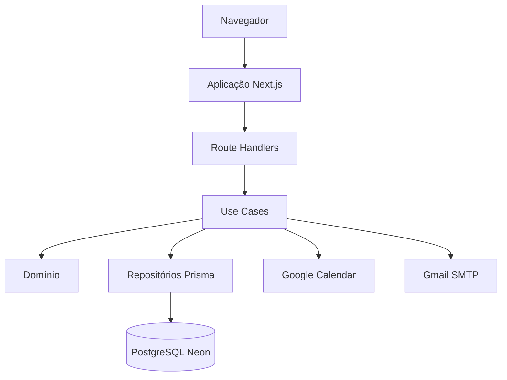

# Diagramas

O diagrama estrutural principal está em [`../architecture/containers.md`](../architecture/containers.md) e no mapa de dependências em [`../architecture/dependencies.md`](../architecture/dependencies.md).

## Fluxo estrutural

Diagramas futuros devem apontar para configuração e código existentes e registrar divergências em vez de representar uma arquitetura desejada como real.
